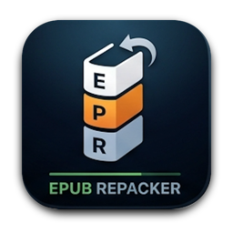

<p align="center">
  
</p>

<h1 align="center">EPUB Repacker</h1>

<p align="center">
  <strong>轻量、快速的 macOS 原生 EPUB 规范重构、自动自愈与批量封装工具（深度集成 Apple Books iCloud 同步）</strong>
</p>

<p align="center">
  <a href="LICENSE"></a>
  
  
  
  
</p>

<p align="center">
  <a href="README.md"><b>English</b></a> | <a href="README_ZH.md"><b>简体中文</b></a>
</p>

---

## 📖 项目简介

在 macOS 系统下解压、二次编辑或制作 `.epub` 电子书时，经常会遇到以下问题：
1. **Mimetype 格式错误**：IDPF / W3C 国际规范强制要求 EPUB 文件的第一个条目必须是 **未压缩（STORED，压缩比为 0）** 且无任何额外扩展字段的 `mimetype` 文件。普通的压缩工具（如 Finder 归档实用工具或标准 zip）无法满足此要求，导致 **Apple Books（图书）**、微信读书等阅读器报错或无法打开。
2. **容器与元数据失效**：缺失 `container.xml` 或清单（`manifest`）与书籍内部章节文件不同步，导致翻页或加载资源时白屏崩溃。
3. **macOS 系统隐藏文件污染**：解压修改过程中系统自动生成的 `.DS_Store`、`__MACOSX` 等杂质残留破坏电子书规范。

**EPUB Repacker** 是一款专为 Mac 设计的原生轻量级桌面应用，只需拖入电子书即可一键自愈修复、严格规范重构，并可直接推送同步至 Apple Books！

---

## ✨ 核心特性

- **严格遵循 IDPF / W3C 标准规范**：
  - 保证 ZIP 归档第 0 个条目为 `mimetype`，采用 `STORED (Method 0)` 无压缩写入，内容严格为 `application/epub+zip`，无额外拓展字段。
  - 正文章节、CSS、字体与图片媒体文件采用标准 `DEFLATE` 压缩。
- **全自动结构自愈修复**：
  - 自动修复并生成标准 `META-INF/container.xml`，准确索引实际根文件（`.opf`）。
  - 全盘扫描内容目录中的 XHTML、CSS、图片与字体，自动补充遗漏的 `manifest` 资源清单并映射标准 MIME；自动清理指向不存在文件的死链项。
- **系统杂质自动清洗**：
  - 自动过滤清除 `.DS_Store`、`__MACOSX`、`Thumbs.db` 等冗余垃圾。
- **深度集成 Apple Books (iCloud) 同步**：
  - 支持直接将封装完成的书籍导出至 Apple Books 同步目录（`~/Library/Mobile Documents/iCloud~com~apple~iBooks/Documents/`），自动同步至 iPhone 与 iPad。
  - 界面常驻「📚 开启 Books 捷径目录」按钮（快捷键 `Cmd + B`），在 Finder 中秒级唤起同步文件夹。
- **支持多语言即时热切换（英文 / 简体中文）**：
  - 默认语言为 **英文（English）**。
  - 主窗口右上角与系统顶部菜单栏双入口即时切换，毫秒级就地更新，**无需重启应用**。
  - 自动持久化保存用户语言偏好。
- **纯原生打造，零第三方依赖**：
  - 使用纯 Swift 6 / AppKit 编写，不引入任何外部第三方开源库。
  - 内存占用不到 20MB，启动响应瞬间完成，体积轻巧（包含 Retina 高清图标仅 1.3MB）。

---

## 🖥️ 界面与交互

```
+-----------------------------------------------------------------------+
|  EPUB Repacker                       [ 📚 Open Books Folder ] [EN|中文]|
+-----------------------------------------------------------------------+
|                                                                       |
|      📦 拖拽一个或多个 EPUB 文件或目录至此处                           |
|      自动修复 mimetype、container.xml、manifest 清单并标准化重封装    |
|                          [ 选择文件 / 目录... ]                       |
|                                                                       |
+-----------------------------------------------------------------------+
|  导出目标位置: (o) 原文件同级  ( ) Apple Books iCloud  ( ) 自定义目录  |
|  当前设置: ~/Library/Mobile Documents/.../Documents/                   |
+-----------------------------------------------------------------------+
|  文件名称               状态 / 变动                         操作      |
|  -------------------------------------------------------------------  |
|  三体.epub              ✅ 完成 (-14.2 KB)          [查看报告] [Finder]|
|  解压修改目录           ✅ 完成 (补齐 3 项清单)     [查看报告] [Finder]|
+-----------------------------------------------------------------------+
|  [ 清空列表 ]                    进度: 2/2          [ 全部开始重新封装]|
+-----------------------------------------------------------------------+
```

### 常用流程：
1. 拖入一本或多本 `.epub` 文件（或解压修改后的电子书文件夹）。
2. 选择导出位置（原文件同级目录、Apple Books 目录、或自定义目录）。
3. 点击 **「全部开始重新封装」**（或按回车键）。
4. 任务完成后，点击 **「查看报告」** 查阅详细修复日志；点击 **「Finder」** 即可定位新书！

---

## 📥 安装与运行

### 方式一：下载预编译版本（推荐）
1. 进入本项目的 [Releases](https://github.com) 发布页面。
2. 下载最新的 `EPUBRepacker-macOS-v1.0.0.zip`。
3. 解压后将 `EPUBRepacker.app` 拖入你的 `/Applications`（应用程序）文件夹即可双击使用！

> **关于 macOS 安全提示**：由于开源个人构建采用本地签名，初次打开时若提示未受信任，可在「系统设置 > 隐私与安全性」中点击「仍要打开」，或在 Finder 中右键点击 App 选择「打开」。

---

### 方式二：从源码编译

#### 运行环境要求：
- macOS 13.0 或更新版本（原生支持 Apple Silicon M 系列芯片与 Intel 芯片）
- Swift 5.9 或更高版本（或安装 Xcode 命令行工具：`xcode-select --install`）

```bash
# 1. 克隆代码仓库
git clone https://github.com/<your-username>/epub-repacker.git
cd epub-repacker

# 2. 运行自动化测试套件（11 项测试）
CLANG_MODULE_CACHE_PATH="$(pwd)/.cache/clang" swift run --disable-sandbox --scratch-path .build/scratch TestRunner

# 3. 编译并打包独立 macOS .app 应用
./scripts/build_app.sh

# 4. 运行编译完成的应用
open dist/EPUBRepacker.app
```

---

## 🏗️ 架构设计

```
epub-repacker/
├── Package.swift                             # SwiftPM 构建配置
├── Sources/
│   ├── EPUBRepackerCore/                     # 核心引擎与逻辑库
│   │   ├── Localization/                     # LocalizationManager, AppLanguage, LocalizationKey
│   │   ├── Models/                           # OutputOption, RepairReport, RepackTaskItem
│   │   ├── Services/                         # EPUBPackager, EPUBExtractor, EPUBRepairer
│   │   └── ViewModel/                        # RepackViewModel（响应式状态流）
│   ├── EPUBRepackerApp/                      # AppKit 原生桌面图形程序
│   │   ├── AppDelegate.swift                 # 应用生命周期与系统菜单栏配置
│   │   ├── MainViewController.swift          # 主视图界面、拖放响应与热切换
│   │   └── Resources/AppIcon.icns            # Retina 全分辨率 macOS 原生应用图标
│   └── TestRunner/                           # 独立自动化测试验证程序
├── scripts/
│   ├── build_app.sh                          # 编译与 Ad-Hoc 签名脚本
│   ├── generate_app_icon.py                  # 超采样抗锯齿图标生成脚本
│   └── package_release.sh                    # 打包 GitHub 发布 Zip 与 SHA256 脚本
└── assets/                                   # 仓库高清图标与徽章资源
```

---

## 🧪 自动化测试体系

项目内置了完备的轻量级测试框架（无需第三方测试库即可快速运行）：

```bash
CLANG_MODULE_CACHE_PATH="$(pwd)/.cache/clang" swift run --disable-sandbox --scratch-path .build/scratch TestRunner
```

**测试覆盖场景：**
- 数据模型初始化与文件尺寸变动智能格式化
- `EPUBPackager` 无压缩 `mimetype` 字节定位与精准验证
- 损坏电子书魔数头校验与自动拦截
- `EPUBRepairer` 损坏书籍解包、结构修复与重封装端到端测试
- 批量异步队列并发与状态流转
- `LocalizationManager` 默认英文回退、UserDefaults 持久化读写以及双语字典 100% 完整覆盖率测试

---

## 📄 开源许可证

本项目基于 [MIT 许可证](LICENSE) 开源。欢迎自由使用、提交 Issue 或发起 Pull Request！
